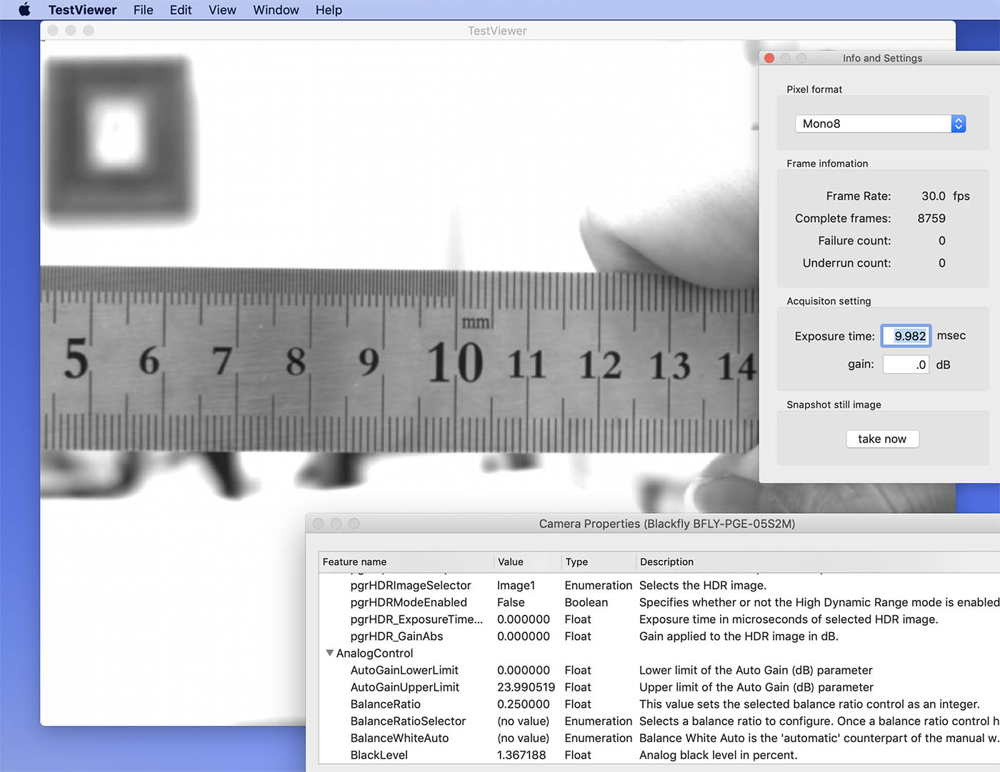
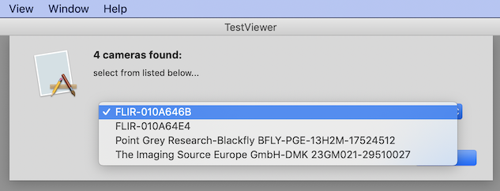

#Cocaravis, Objective-C wrapper of aravis

Cocaravis is a framework on macOS and a wrapper of  [aravis](https://github.com/AravisProject/aravis) library. Aravis is a Gen$<$i$>$Cam camera library via. GigE and USB3 interfaces  for linux. Of course, aravis can also work on macOS but aravis library needs

1. some dependent libraries originated on linux and absent on current macOS.
2. knowledge of GObject, GMainLoop and GThread etc. that a typical macOS programmer doesn't know much about.

Cocaravis framework provides Objetive-C API to use aravis library easily without knowledge about GNOME clichés.

Cocaravis is currently based on aravis-0.6.3 and glib, gettext and other libraries from [homebrew](https://github.com/Homebrew) and some libraries existing originally in /usr/lib on macOS. Cocaravis includes them as embedded dynamic library resources except built-in libraries in standard directories of macOS.

# Object configuration

Cocaravis is simple, straightforward and small framework. Some objects in Cocaravis are simply direct wrappers of major objects of aravis.

| aravis object | Cocaravis object |
| ------------- | ---------------- |
| ArvCamera     | CoACamera        |
| ArvDevice     | CoADevice        |
| ArvStream     | CoASream         |
| ArvBuffer     | CoABuffer        |

Cocaravis also has objects that are not direct wrappers but functional substitutes.

| aravis object        | Cocaravis object                    |
| -------------------- | ----------------------------------- |
| Arv                  | CoACameraFinder                     |
| ArvGc,ArvGcNode etc. | CoACameraFeature,CoAFeatureCategory |

And objects for macOS exclusive.

| Cocaravis object  | function                                                   |
| ----------------- | ---------------------------------------------------------- |
| CoABitmapImageRep | convert image buffer to bitmap image for display on NSView |
| CoAFrameAverager  | frame accumulator to reduce random noise                   |

CoAFrameAverager class is planned for illuminance measurement performing simple moving average by sliding window method through frame by frame. The function should only be enabled for uncompress and gamma=1 image acquisition of a Gen$<$i$>$Cam camera.

# Usage

## to build from source codes

1. install dependent libraries (listed bellow. Also in Frameworks on Project Navigator panel of Xcode). Homebrew is easy to do.

2. build aravis by autotools procedure (configure/make) for aravis.0.6.3.  For other version of aravis, refer the github repository.

3. build Cocaravis on Xcode.


### depended libraries

- libaravis-0.6.dylib

- libusb-1.0.dylib

- libgobject-2.0.dylib

- libgthread-2.0.dylib

- libglib-2.0.dylib

- libgio-2.0.dylib

- libgmodule-2.0.dylib

- libintl.dylib

- libpcre.dylib

- libffi.dylib

Other indispensable libraries i.e., libxml2, libz, etc. are equipped to macOS and may be linked dynamically.

### how to build aravis on macOS

There are several ways to install stable aravis-0.6 onto macOS 10.14.

####via. homebrew directly

```
brew install aravis
```

But a *LARGE NUMBER of packages* related to arv-viewer are installed with the direct installation.

#### install manually using homebrew

following the aravis document (from now on, bash is assumed for shell),

1. donwload tarball from stable release site and expand

   ```sh
   curl -O http://ftp.gnome.org/pub/GNOME/sources/aravis/0.6/aravis-0.6.3.tar.xz
   tar zxf aravis-0.6.3.tar.xz
   cd aravis-0.6.3
   ```

2. install depended libraries via. homebrew

   ```sh
   brew install pkg-config gettext intltool glib libusb pcre libffi
   brew link --force gettext
   brew link --force intltool
   brew link --force glib
   brew link --force libusb
   brew link --force libffi
   ```

   command "brew link" creates symbolic link of headers and libraries to standard directories, i.e., /usr/local/include, /usr/local/lib etc...

3. to suppress pkg-config  (a countermeasure for conflicting with existing packages or libraries but pkg-config itself is needed to install the libraries above.)

   ```sh
   export ARAVIS_CFLAGS="-I/usr/local/include/glib-2.0"
   export ARAVIS_CFLAGS+=" -I/usr/local/lib/glib-2.0/include"
   export ARAVIS_CFLAGS+=" -I/usr/local/include/libusb-1.0"
   export ARAVIS_CFLAGS+=" -I/Applications/Xcode.app/Contents/Developer/Platforms/MacOSX.platform/Developer/SDKs/MacOSX.sdk/usr/include/libxml2"
   export ARAVIS_LIBS="-L/usr/lib -L/usr/local/lib -L/usr/local/opt/libffi/lib"
   export ARAVIS_LIBS+=" -lusb-1.0 -lgio-2.0 -lgobject-2.0 -lxml2 -lglib-2.0 -lintl -lffi -lm"
   ```

   note that the path to libxml headers should be chacked. The libxml2.dylib library is installed in /usr/lib but their headers are not in /usr/include on macOS (first of all, the directory /usr/include does not exist on macOS !).

   And if you want use clang compiler instead of gcc ( gcc is no longer updated on macOS).
   
   ```sh
   export CC=clang
   ```
   
4. create makefile by configure

   ```sh
   ./configure --enable-usb --disable-viewer
   ```

   It is recommended that the last logs from the configure script is cheked.

5. make and install

   ```sh
   make
   sudo make install
   ```

#### other ways

You may use other package manager like [MacPorts](https://www.macports.org) or compile from sources manually to install depended libraries.

## include framework

to use Cocaravis,

1. include the Cocaravis.framework  to "link binary With Libraries" on "build phase" in your Xcode project

2. include the line bellow

   ```objective-c
   #import <Cocaravis/Cocaravis.h>
   ```

   in your Objecitve-C source codes.


## how to use Cocaravis

### device enumeration

get referrence to CoACameraFinder object by

```objective-c
+ (CoACameraFinder *)sharedCameraFinder;
```

refer its property

```objective-c
@property (readonly) NSArray<CoADeviceSignature *>     *connectedDevices;
```

###specify desired camera

pick up a desired device from the array and call

```objective-c
- (instancetype)initWithDeviceSignature:(CoADeviceSignature * __nonnull)signature;
```

to get CoACamera object.

REMARK:*ArvCamera object can be passed NULL as an argument, but CoACamera cannot in current version.*

###create stream object

If you got object (not nil), create stream and set delegate object

```objective-c
    CoAStream *stream = [camera createCoAStreamWithPooledBufferCount:30];
    if (stream != nil) {
        stream.receiver = self; // self should adopt CoAStreamReceiveProtocol
```

###start transfer

```objective-c
    [camera startAquisition];
```

then you can receive image buffer in a delegate method

```objective-c
- (void)stream:(CoAStream *)stream receiveBuffer:(CoABuffer *)buffer;
```

REMARK:*This delegate method ls called on a data receiving thread, not on a main thread. When you want to display on NSView you should transfer control to main thread using methods like performSelectorOnMainThread:withObject:waitUntilDone: etc.*

###display on a subclass of NSView

Create NSBitmapImageRep object using a method of CoABitmapImageRep

```objective-c
@interface CoABitmapImageRep : NSBitmapImageRep
+ (instancetype)imageRepWithImageBuffer:(CoAImageBuffer *)imageBuffer;
```

You can draw directly in NSView by NSBitmapImageRep methods, or create NSImage.

###verification and alteration of camera properties

Create CoAFeatureCategory object from CoADevice.

```objective-c
@interface CoAFeatureCategory : NSObject
- (instancetype)initWithDevice:(CoADevice *)device;
```

Then its property categorizedFeatures has key-value pairs of property name (NSString) and CoACameraFeature object.

```objective-c
@property (readonly) NSDictionary   *categorizedFeatures;
```

If Gen$<$i$>$Cam description file has nested features, categorizedFeatures property consists of category name and dictionary pairs as key-value pair.

The CoACameraFeature class has subclasses according to Gen$<$i$>$Cam node types. For example, float node type has propeties and methods

```objective-c
@interface CoAFloatFeature : CoACameraFeature
@property (readonly) NSString   *unit;
@property (readonly) CGFloat    min;
@property (readonly) CGFloat    max;
@property (readonly) CGFloat    currentValue;

- (BOOL)setFloatValue:(CGFloat)value;
```

you can verify its value by property currentValue and later value by setFloatValue: method.The method returns YES when the alteration was effective.

Details of the subclasses, refer header file CoACameraFeature.h.

# limitations of current version

- CoABuffer can only create image buffer. Other payload types, i.e., jpeg or chunk, are not supported.
- CoAImageBuffer (subclass of CoABuffer) can recevie only 8 bits per sample image.
- CoAImageBuffer can not convert bayer format to RGB format.
- CoAImageBuffer can not convert YUV format to RGB format. The conversion can be performed by vImageYpCbCrType of vImage in Accelerate framework.
- Fake camera of aravis can not be instantiated.
- Some subclasses of ArvFeatureNode are not implemented because of less importance.

# TestViewer app.

The Xcode project includes simple viewer Cocoa application for testing and demonstration. 



The app performs

1. check interfaces and enumerate connected cameras.

2. if only one camera is connected, the app starts the image data transfer.

3. if two or more cameras are found, the app shows a dialog to select one of them.

   

4. from the limitations, the app set pixel mode of the camera to RGB8Packed or Mono8 mode if the camera supports them, and if not, perhaps the app may not display images.

5. The app has two panels, "info and settings" and "Camera Properties" (see a screen shot above)

6. The panels can be ordered front by selecting submenues on "Window" menu.

7. a user can check real frame rate and set exposure time and gain on "info and settings" panel.

8. a user can also take a snapshot image to save to a file (now, TIFF format only).

9. a user can check properties of the connected camera on "Camera Properties" panel. The properties are read from description file built-in the camera following Gin$<$i$>$Cam standard but a function to change a writable property is curently not implemented.

The app does not have enough functions as a viewer app beacuse it is only for testing or debugging.

# calling from swift

If you write your source codes in swift for macOS apps you can call the framework but overhead from swift to Objective-C will be heavier than that to C. It is recomended to call aravis directly instead of via. Cocaravis.

# NOTICE: NO BUILT FRAMEWORK IS NOT ON THIS REPOSITORY

I'm sorry that a built Cocaravis framework package is not on this repository because it is awkward for me to embed codesign in the framework.

If you want it, please install the dependent libraries and build the framework.

# Links

aravis github repository: https://github.com/AravisProject/aravis

author's e-mail:	decafish@gmail.com

author's blog:	https://decafish.blog.so-net.ne.jp (but sorry in Japanese)


